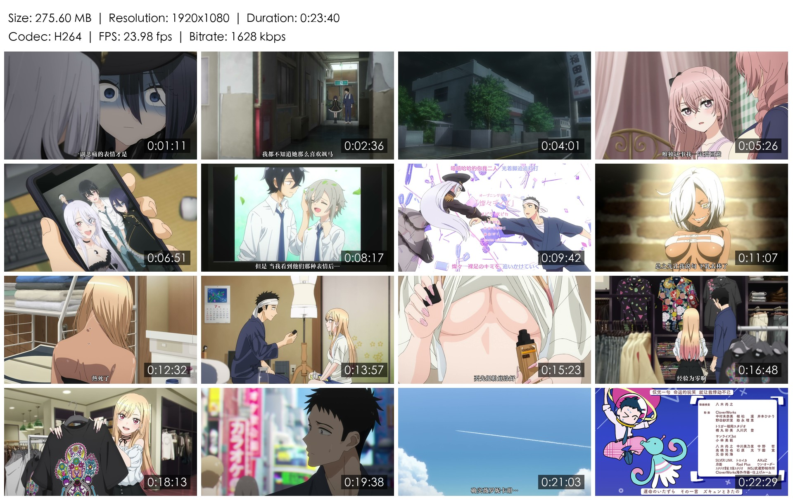
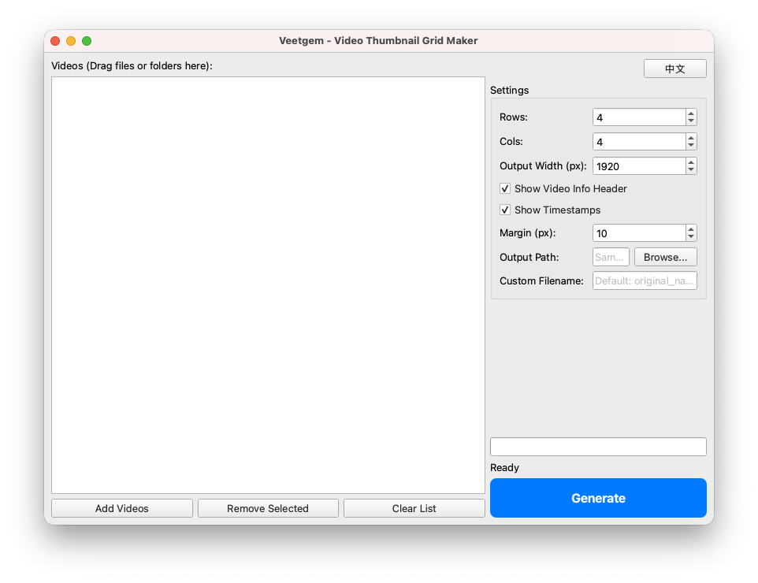

<h1 align = "center">Veetgem</h1>

<p align = "center">
    A video thumbnail grid generator that extracts frames from local videos and merges them into a single image for quick preview.
</p>

<p align = "center">
    <a href = "README.md" target = "_blank">EN</a> | <a href = "README_zh.md" target = "_blank">CN</a>
</p>

---

## 🚀 Features

- **Format Support**: Supports major video formats including mp4, mkv, flv, etc.
- **Smart Sampling**: Automatically distributes screenshots between 5% and 95% of the video duration to avoid common black frames, titles, and credits at the beginning or end.
- **Information Overlay**:
    - The top of the output grid displays file size, resolution, duration, codec, FPS, and bitrate. Font size and spacing automatically scale based on the target resolution to ensure legibility at any size.
    - Each screenshot features a timestamp with a semi-transparent black background bar in the bottom-right corner, marking its position in the video.
- **Customizable Options**:
    - Number of rows and columns (determining the total number of screenshots).
    - Output image width (height is automatically adjusted proportionally).
    - ...
- **Modern Design**:
    - Full Drag & Drop support for both files and folders.
    - Automatic system language detection (Chinese/English) with an intuitive interface and one-click manual toggle.
    - Asynchronous processing logic ensures the UI remains responsive while processing videos, providing real-time progress feedback.

---

## 📝 Usage

1. **Add Videos**: Drag video files or folders directly into the left-side list.
2. **Settings**: Adjust custom options as needed.
3. **Generate**: Click the `Generate` button. By default, the preview image will be saved in the same folder as the source video.

---

## 🌅 Showcases

|           Output Preview Grid            |
|:----------------------------------------:|
|   |
|    From "My Dress-Up Darling" Ep. 10     | 

|      Application Screenshot       |
|:---------------------------------:|
|          |

---

## 🛠 Development Environment

### Local Development Environment

- **OS**: macOS 26.3
- **Language**: Python 3.14.3
- **Libraries**:
    - **PySide6** (6.10.2): Used for building the Graphical User Interface.
    - **Pillow** (12.1.1): Used for image stitching and rendering.
- **External Dependency**: FFmpeg (Installed via Homebrew).

### Prerequisites

Install FFmpeg:

```bash
brew install ffmpeg
```

Install Python dependencies:

```bash
pip3 install -r requirements.txt
```

---

## 📂 Project Structure

- `main.py`: Entry point, responsible for UI layout and task scheduling.
- `i18n.py`: Internationalization dictionary and system language auto-detection logic.
- `video_engine.py`: Video engine, responsible for FFmpeg calls.
- `image_engine.py`: Image engine, responsible for Pillow stitching algorithms.
- `build_app.py`: Automated packaging script for generating standalone macOS applications.

---

## 📦 Packaging to .app

Build a standalone macOS `.app` that includes FFmpeg and starts instantly:

1. Ensure `pyinstaller` is installed:
   ```bash
   pip3 install pyinstaller
   ```
2. Run the build script:
   ```bash
   python3 build_app.py
   ```
3. Find the packaged software under the `dist/` directory.

---

## ⚠️ Notes

- **The code is entirely AI-generated and may not be error-free!**
- The entire process from development to packaging was performed on an Apple Silicon-based Mac. It has not been tested on other operating systems. **If developing on other OS, please check code compatibility.** For example, the program uses the macOS system font "PingFang SC" by default; ensure compatible fonts are installed if running on other systems.
- The development version relies on the system's FFmpeg PATH. The version packaged via `build_app.py` includes its own binary files, requiring no extra configuration.
