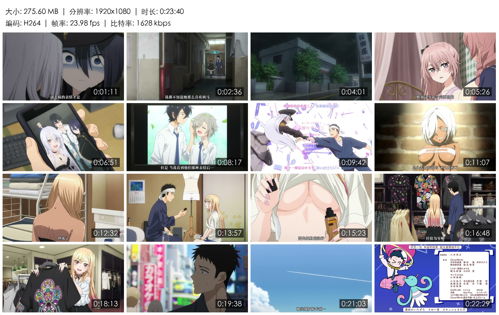
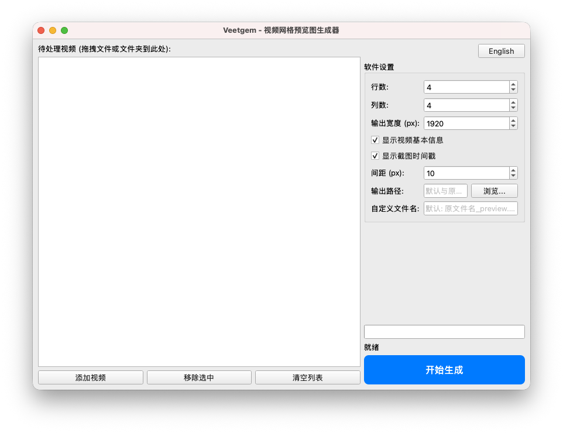

<h1 align = "center">Veetgem</h1>

<p align = "center">
    一个视频网格预览图生成器，从本地视频中提取画面并拼接，最终生成一张大图以快速预览影片。
</p>

<p align = "center">
    <a href = "README.md" target = "_blank">EN</a> | <a href = "README_zh.md" target = "_blank">CN</a>
</p>

---

## 🚀 功能特性

- **格式支持**：支持 mp4、mkv、flv 等主流视频格式。
- **智能采样**：自动在视频的 5% 到 95% 之间均匀提取画面，以避开开头和结尾常见的黑屏、标题、制作组名单等内容。
- **信息记录**：
    - 在最终输出的网格预览图的顶部将记录视频的文件大小、分辨率、时长、编码、帧率、比特率。同时这些内容的字体、间距会根据目标分辨率自动进行比例缩放，确保在任何尺寸下都具备可读性。
    - 在每张截图的右下角都存在半透明黑色背景条的时间戳，用于记录该截图在视频中的位置。
- **自定义项**：
    - 最终输出的预览图的行列数（行列数决定截图的数量）。
    - 最终输出的预览图的宽度（高度将按比例自动调整）。
    - ……
- **现代设计**：
    - 支持直接拖拽文件及文件夹进行导入。
    - 自动识别系统语言（中/英）并在界面上显示为对应语言，同时支持一键手动切换。
    - 采用异步处理逻辑，确保在处理视频时，界面持续响应，并实时反馈进度。

---

## 📝 使用方法

1. **添加视频**：将视频文件或文件夹直接拖入左侧列表。
2. **软件设置**：根据需要对自定义选项进行设置。
3. **开始生成**：点击`开始生成`按钮。预览图默认将保存在原视频所在的文件夹下。

---

## 🌅 效果展示

|             最终生成的预览图             |
|:--------------------------------:|
|  |
|        来自《更衣人偶坠入爱河》第 10 集        | 

|        程序界面截图        |
|:--------------------:|
|  |

---

## 🛠 开发环境

### 本机开发环境

- **操作系统**：macOS 26.3
- **语言**：Python 3.14.3
- **库**：
    - **PySide6**（6.10.2）：用于构建图形用户界面。
    - **Pillow**（12.1.1）：用于图像拼接与绘制。
- **外部依赖**：FFmpeg（通过 Homebrew 安装）。

### 运行准备

安装 FFmpeg：

```bash
brew install ffmpeg
```

安装 Python 依赖库：

```bash
pip3 install -r requirements.txt
```

---

## 📂 项目结构

- `main.py`：程序入口，负责 UI 布局与任务调度。
- `i18n.py`：国际化字典及系统语言自动识别算法。
- `video_engine.py`：视频引擎，负责 FFmpeg 调用。
- `image_engine.py`：图像引擎，负责 Pillow 拼接算法。
- `build_app.py`：自动化打包脚本，用于生成 macOS 独立应用。

---

## 📦 打包至 .app

打包一个包含 FFmpeg 且快速启动的独立 macOS `.app`：

1. 确保安装了 `pyinstaller`：
   ```bash
   pip3 install pyinstaller
   ```
2. 运行打包脚本：
   ```bash
   python3 build_app.py
   ```
3. 在`dist/`下找到打包好的软件。

---

## ⚠️ 注意事项

- **代码均由 AI 生成，其未必正确无误！**
- 程序从开发至打包的全过程的操作均位于基于 Apple Silicon 的 Mac 上执行，没有在别的操作系统上进行过测试，**如果使用别的操作系统进行开发，请对代码兼容性进行检查**。例如程序默认使用了 macOS 系统字体苹方，如在其它系统运行，请确保已安装相应的字体。
- 开发版本依赖于系统的 FFmpeg 环境路径。通过`build_app.py`打包后的版本则自带二进制文件，无需额外配置。
